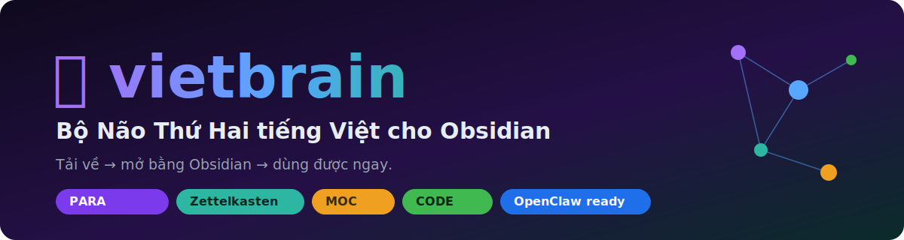
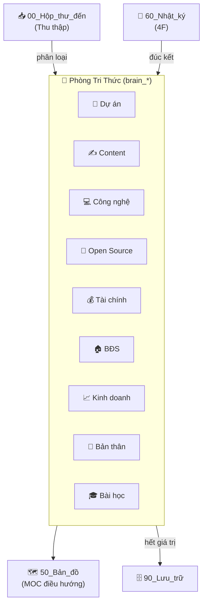
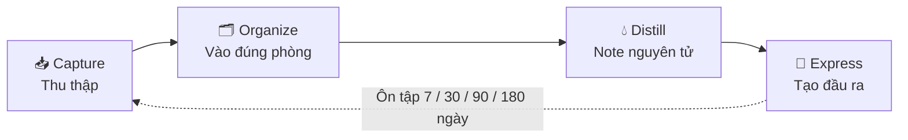

<div align="center">



# 🧠 vietbrain

### Bộ khung **"Bộ Não Thứ Hai"** tiếng Việt cho Obsidian — sẵn sàng vận hành cùng AI Agent

*Tải về → mở bằng Obsidian → dùng được ngay. Một "căn nhà tri thức" có tổ chức, khoa học, và biết tự bảo trì.*


</div>

---

## 🎁 vietbrain là gì?

`vietbrain` là **bộ khung Obsidian** giúp bạn dựng một **Bộ não thứ hai** (Second Brain) bài bản trong 5 phút, **hoàn toàn bằng tiếng Việt**. Nó kết hợp những phương pháp quản lý tri thức tốt nhất thế giới — **PARA** (Tiago Forte), **Zettelkasten** (Niklas Luhmann), **MOC** (Maps of Content) và quy trình **CODE** — rồi gói lại theo mô hình **"Phòng Tri Thức"** dễ hiểu cho người Việt.

Điểm đặc biệt: vault được thiết kế để **một AI Agent (OpenClaw) vận hành cùng bạn** — tự dọn dẹp, tự nhắc ôn tập theo lịch và nhắn tin hỏi ý kiến bạn qua Zalo/Telegram. (Phần AI là **tùy chọn** — không cài vẫn dùng tốt.)

> 🇻🇳 Một món quà mở cho cộng đồng. Tải về, xài, chỉnh theo ý bạn — thoải mái.

---

## ✨ So với các template free khác, vietbrain hơn ở đâu?

| Tiêu chí | Template phổ biến khác | **vietbrain** |
|---|:---:|:---:|
| **Ngôn ngữ** | Tiếng Anh | ✅ **Tiếng Việt hoàn toàn** |
| **AI** | CLI gọi thủ công (Claude Code/Copilot) | ✅ **AI Agent always-on** (OpenClaw) + **Zalo/Telegram** + **cron tự bảo trì** |
| **Graph view** | Mặc định (rối) | ✅ **Tô màu sẵn theo từng phòng** |
| **Cấu trúc** | PARA *hoặc* Zettelkasten thuần | ✅ **Hybrid**: Phòng tri thức đời sống + PARA + Zettelkasten + MOC + CODE |
| **Phòng trống** | Để trống, khó bắt đầu | ✅ Mỗi phòng có **Mục lục tự liệt kê** (Dataview) |
| **Quản trị** | Tản mát | ✅ **Hiến pháp Vault** — 1 nguồn chân lý cho mọi quy tắc |

---

## 🗂️ Cấu trúc

```
🧠 PHÒNG TRI THỨC (theo chủ đề cuộc sống)
00_Hộp_thư_đến/        📥 Thu thập mọi thứ vào đây trước (Inbox)
01_brain_dự_án/        💼 Dự án đang làm / đã làm
02_brain_content/      ✍️ Nội dung viết (0_Nháp, 1_Đã_đăng)
03_brain_công_nghệ/    💻 Lập trình, kỹ thuật, AI
04_brain_open_source/  🦞 Repo hay, mã nguồn mở
05_brain_tài_chính/    💰 Tài chính, đầu tư
06_brain_bất_động_sản/ 🏠 Bất động sản
07_brain_kinh_doanh/   📈 Kinh doanh, marketing
08_brain_phát_triển_bản_thân/ 🌱 Kỹ năng, tư duy, hồ sơ
09_brain_bài_học/      🎓 Bài học đúc kết

⚙️ KHUNG VẬN HÀNH
50_Bản_đồ/             🗺️ Bản đồ tri thức (MOC) — bắt đầu ở "Trang chủ"
60_Nhật_ký/            📅 Nhật ký hàng ngày (khung 4F)
90_Lưu_trữ/            🗄️ Lưu trữ cái đã xong
99_Hệ_thống/           ⚙️ Hiến pháp, Templates, hướng dẫn
```

> 💡 Cứ **thêm/xóa/đổi tên phòng** theo cuộc sống của bạn: `10_brain_sức_khỏe/`, `11_brain_du_lịch/`...

### 🗺️ Sơ đồ luồng tri thức



---

## 🚀 Bắt đầu trong 5 phút

1. **Tải repo** này về (Code → Download ZIP, hoặc `git clone`).
2. Mở **Obsidian** → *Open folder as vault* → chọn thư mục `vietbrain`.
3. Mở **`50_Bản_đồ/Trang chủ.md`** — đây là cửa chính, điều hướng mọi thứ.
4. (Khuyến nghị) Vào *Settings → Community plugins*, bật **Dataview**, **Templater**, **Calendar** để các bảng tự động chạy.
5. Bắt đầu: gõ ý tưởng vào `00_Hộp_thư_đến/`, cuối tuần dọn vào đúng phòng.

> Vault dùng được **ngay lập tức** với plugin lõi (Daily Notes, Templates, Graph). Dataview chỉ để các danh sách tự cập nhật.

---

## 🧭 Triết lý vận hành (CODE)

**Capture → Organize → Distill → Express**
Thu thập vào Inbox → Sắp xếp vào đúng phòng → Chưng cất thành ghi chú nguyên tử (1 ý/note, hiểu trong 10 giây) → Dùng tri thức tạo ra đầu ra. Ôn tập ngắt quãng **7 → 30 → 90 → 180 ngày**.



Chi tiết đầy đủ: đọc **[Hiến pháp Vault](99_Hệ_thống/vault-constitution.md)**.

---

## 🤖 (Tùy chọn) Kết nối AI Agent

Vault được thiết kế để **OpenClaw** vận hành cùng bạn: tự quét vault theo lịch, đề xuất dọn dẹp/ôn tập, và **nhắn tin hỏi ý kiến bạn qua Zalo/Telegram trước khi làm gì** (không bao giờ tự xóa file).

👉 Xem **[Hướng dẫn Cài đặt OpenClaw](99_Hệ_thống/Hướng%20dẫn%20Cài%20đặt%20OpenClaw.md)** và điền thông tin vào **[AGENT.md](AGENT.md)**.

---

## 🎨 Mẹo: Graph view đã được tô màu sẵn

Repo kèm sẵn cấu hình Graph (`.obsidian/graph.json`): mỗi phòng một màu, ẩn node rác, lọc bỏ template. Mở **Graph view** là thấy bộ não gọn gàng, có tổ chức ngay.

<!-- 📸 Mẹo: chụp Graph view của bạn, lưu thành assets/graph.png rồi bỏ comment dòng dưới để khoe ảnh thật:
<div align="center"></div>
-->

<div align="center">
  
</div>

---

## 📜 License

[MIT](LICENSE) — tự do dùng, sửa, chia sẻ, kể cả thương mại. Chỉ cần giữ ghi công.

## 🙌 Tác giả & Đóng góp

Làm bởi **tuanminhhole (Kent)** như một món quà mở cho cộng đồng người Việt yêu Obsidian & PKM.
Mọi góp ý / PR cải tiến khung đều được hoan nghênh. Nếu thấy hữu ích, hãy ⭐ repo để nhiều người biết tới nhé!

---

## 🦞 Hệ sinh thái OpenClaw (cùng tác giả)

Bộ khung này hợp nhất với **OpenClaw** — AI Agent mã nguồn mở. Các repo liên quan để bạn dựng "bộ não tự vận hành" hoàn chỉnh:

**🚀 Cài đặt & hạ tầng**
- [openclaw-setup](https://github.com/tuanminhhole/openclaw-setup) — Setup AI bot miễn phí bằng OpenClaw + Google Gemini (Telegram/Docker)

**🔌 Plugin (runtime)**
- [openclaw-telegram-multibot-relay](https://github.com/tuanminhhole/openclaw-telegram-multibot-relay) — Multibot Telegram relay, delegation & cron nhắc lịch native
- [openclaw-zalo-mod](https://github.com/tuanminhhole/openclaw-zalo-mod) — Quản lý nhóm Zalo zero-token (slash command, anti-spam, warn, memory)
- [openclaw-browser-automation](https://github.com/tuanminhhole/openclaw-browser-automation) — Smart Search & Browser Automation
- [openclaw-facebook-crawler](https://github.com/tuanminhhole/openclaw-facebook-crawler) — Crawl dữ liệu Facebook
- [openclaw-n8n-facebook-poster](https://github.com/tuanminhhole/openclaw-n8n-facebook-poster) — Tự động đăng Facebook qua n8n

**🧩 Skill**
- [openclaw-skill-super-memory](https://github.com/tuanminhhole/openclaw-skill-super-memory) — Bộ nhớ nâng cao cho agent
- [openclaw-skill-infographic](https://github.com/tuanminhhole/openclaw-skill-infographic) — Tạo infographic
- [openclaw-skill-zalo-sticker-mention](https://github.com/tuanminhhole/openclaw-skill-zalo-sticker-mention) — Sticker & mention trên Zalo

<div align="center">
<sub>🧠 <b>vietbrain</b> · một phần của hệ sinh thái <a href="https://github.com/tuanminhhole">tuanminhhole (Kent)</a> · MIT License</sub>
</div>
